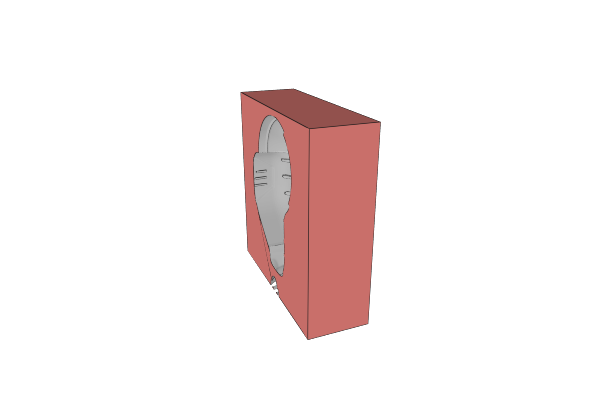
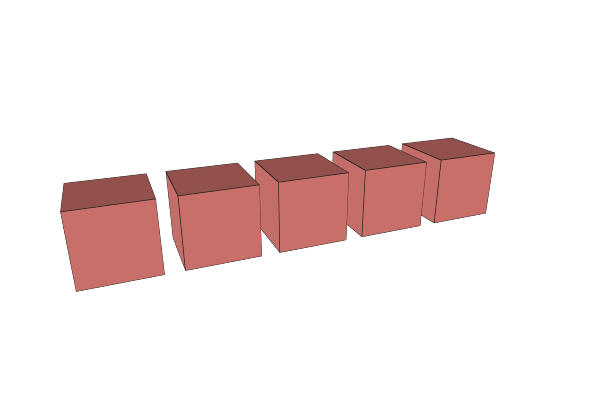
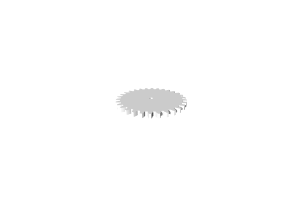
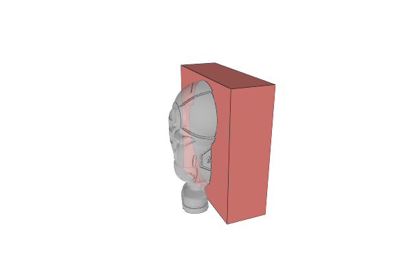
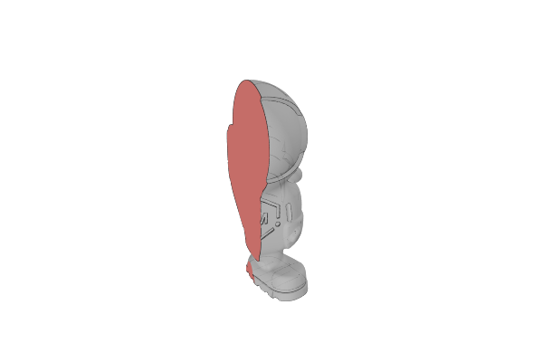
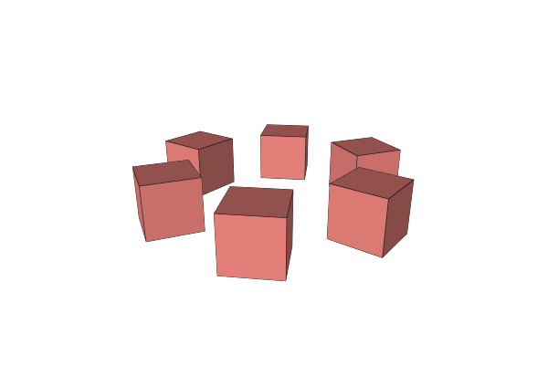
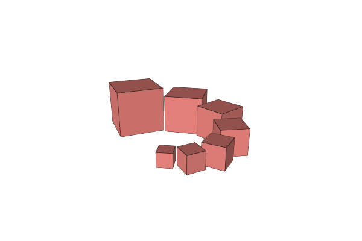

# MatterCAD Documentation

**MatterCAD** is a powerful, intuitive 3D design application built for makers, engineers, and creators. Design parts from scratch using parametric primitives, boolean operations, arrays, and more — then export for 3D printing or CNC machining.

This repository hosts the official MatterCAD documentation, served publicly via [GitHub Pages](https://matterhackers.github.io/MatterCAD_Docs/).

---

## Browse the Docs

**[View Documentation](https://matterhackers.github.io/MatterCAD_Docs/Help/)**

### What You Can Design

| Boolean Operations | Array Patterns | Mechanical Parts |
| :---: | :---: | :---: |
|  |  |  |
| Combine, subtract, and intersect solids | Linear, radial, and advanced arrays | Gears, threads, and precision parts |

### Powerful Operations

|  |  |  |  |
| :---: | :---: | :---: | :---: |
| Combine | Intersect | Radial Array | Advanced Array |

---

## Key Features

- **Parametric 3D Modeling** — Cubes, cylinders, spheres, cones, tori, and more with precise dimensional control
- **Boolean Operations** — Combine, subtract, intersect, and subtract-and-replace to build complex shapes
- **Array Tools** — Linear, radial, and advanced arrays for repeating patterns
- **Reshape Operations** — Bevel, curve, twist, pinch, hollow out, and plane cut
- **Path Operations** — Linear extrude, revolve, inflate, merge, border, and smooth paths
- **2D Path Primitives** — Box, circle, ring, star, and custom paths for extrusion workflows
- **Mechanical Parts** — Built-in gear and thread generators
- **Design Primitives** — Text, QR codes, braille, SVG import, and image conversion
- **Expressions** — Parametric dimensions with mathematical expressions
- **Components** — Save and reuse design building blocks
- **Cloud Library** — Store, organize, and share designs across devices
- **Export** — STL, AMF, OBJ, and other formats for 3D printing and manufacturing

---

## Documentation Topics

- [Getting Started](https://matterhackers.github.io/MatterCAD_Docs/Help/getting-started/) — First steps, viewport navigation, creating and editing objects
- [Primitives](https://matterhackers.github.io/MatterCAD_Docs/Help/primitives/) — All 3D shape primitives
- [Operations](https://matterhackers.github.io/MatterCAD_Docs/Help/operations/) — Boolean, array, reshape, transform, path, and mesh operations
- [Workspace](https://matterhackers.github.io/MatterCAD_Docs/Help/workspace/) — Keyboard shortcuts, mouse controls, expressions, components
- [Designing](https://matterhackers.github.io/MatterCAD_Docs/Help/designing/) — Design workflows and techniques
- [Library](https://matterhackers.github.io/MatterCAD_Docs/Help/library/) — Cloud and local library management

---

## Reporting Issues

MatterCAD's main repository is private, but you can report bugs, request features, or ask questions by [opening an issue here](https://github.com/MatterHackers/MatterCAD_Docs/issues). We actively monitor this repository for community feedback.

When reporting an issue, please include:
- What you were trying to do
- What happened instead
- Steps to reproduce (if applicable)
- Your MatterCAD version (Help > About)

---

## About MatterCAD

MatterCAD is developed by [MatterHackers](https://www.matterhackers.com), the team behind MatterControl. It focuses exclusively on 3D design — no printer management or slicing — providing a clean, focused experience for creating parts and assemblies.

**[Download MatterCAD](https://www.matterhackers.com/store/l/mattercad/sk/M0Y1YPCA)**
